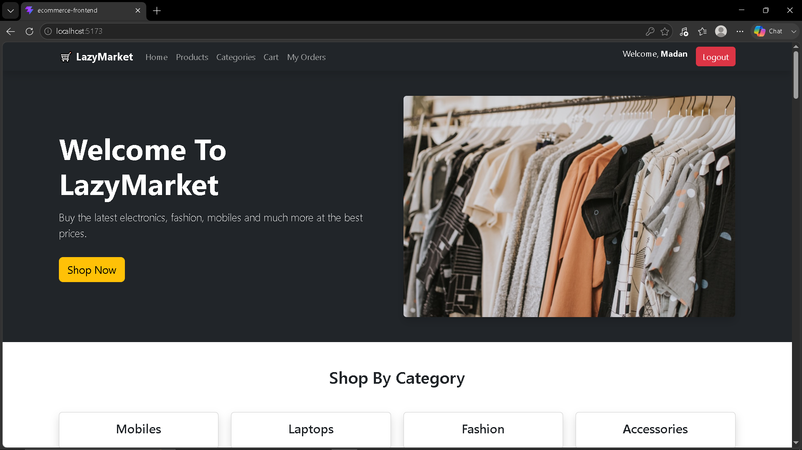
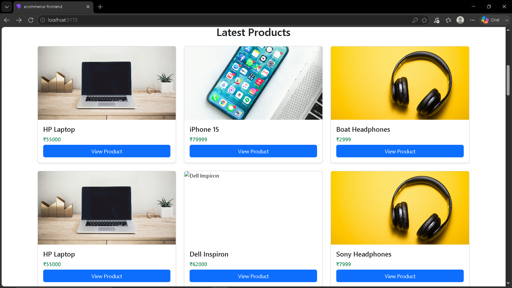
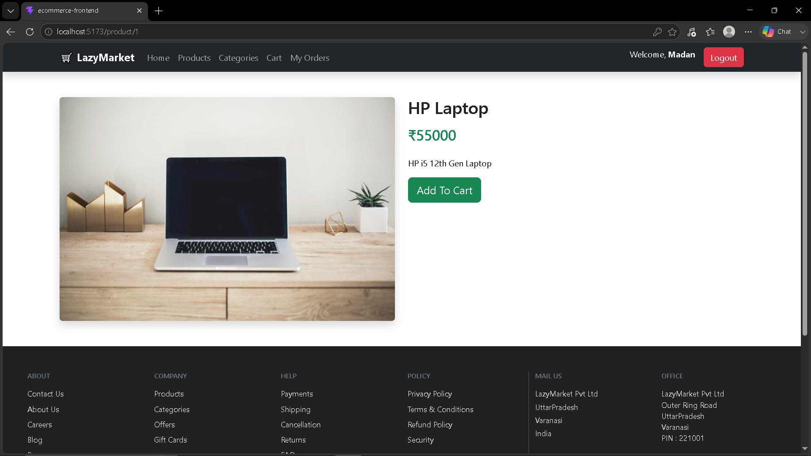
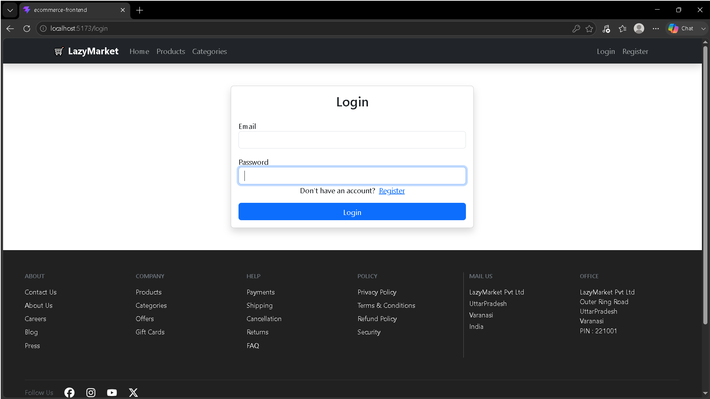
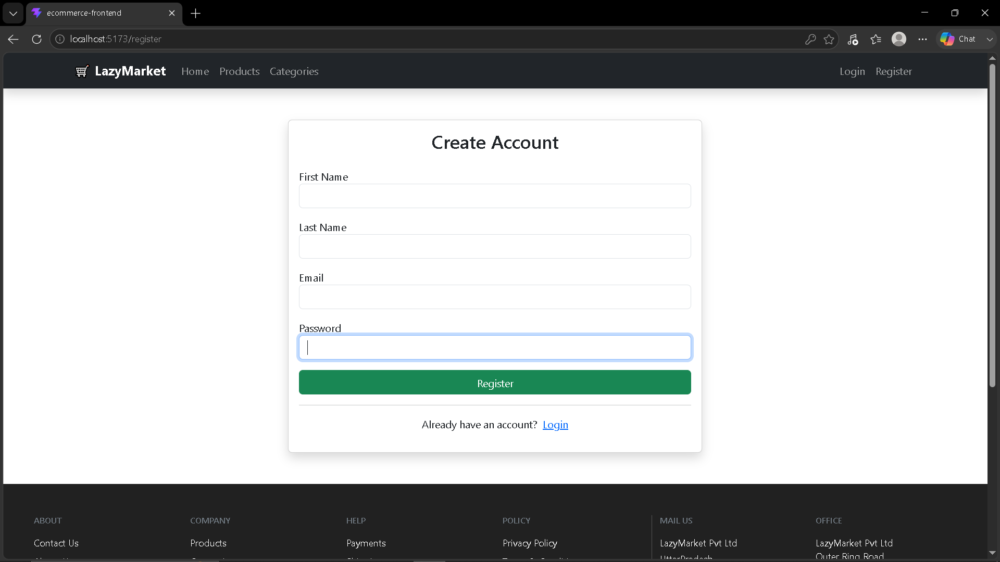

# 🛒 Full Stack E-Commerce Application

A full-stack e-commerce web application developed using **Java, Spring Boot, MySQL, React.js, and REST APIs**.

The application follows a frontend-backend architecture where the **React.js frontend communicates with the Spring Boot backend through RESTful APIs**.

---

## 🚀 Features

### 🔹 Backend

- Product Management
- Product Listing
- Product Details
- Category Management
- Product Search
- Product Filtering
- Pagination
- Sorting
- Price Range Filtering
- RESTful APIs
- MySQL Database
- JPA / Hibernate
- Layered Architecture

### 🔹 Frontend

- React.js
- React Router
- Product Listing
- Product Details
- Category-based Products
- Axios API Integration
- Responsive User Interface

---

## 🛠️ Technologies Used

### Backend

- Java
- Spring Boot
- Spring Data JPA
- Hibernate
- MySQL
- REST APIs
- Maven

### Frontend

- React.js
- JavaScript
- Axios
- React Router

### Tools

- IntelliJ IDEA
- Visual Studio Code
- Git
- GitHub
- MySQL

---

## 📸 Screenshots

### 🏠 Home Page



### ### 📦 Products Page



### 📦 Products Details



### 🔐 Login Page



### 📝 Register Page




## 🏗️ Project Structure

```text
FullStack-Ecommerce/
│
├── ecommerce-backend/
│   ├── src/
│   ├── pom.xml
│   └── ...
│
├── ecommerce-frontend/
│   ├── src/
│   ├── package.json
│   └── ...
│
├── ScreenShot/
│   ├── Home.png
│   ├── Login.png
│   ├── Products.png
│   ├── ProductsDetails.png
│   └── Register.png
│
└── README.md


